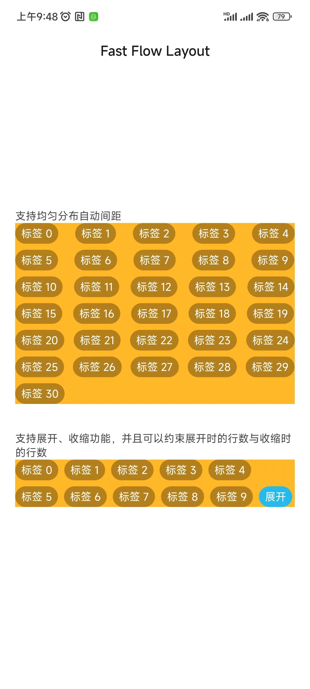

# fast-flow-layout

[](https://jitpack.io/#Arcns/fast-layout-manager)

> 一个优雅的Android的流布局，支持均匀分布自动间距，支持展开、收缩功能，并且可以约束展开时的行数与收缩时的行数。

> 感谢[nex3z/FlowLayout](https://github.com/nex3z/FlowLayout)，本项目是在该项目的基础上进行扩展开发。



#### 1.集成方式：

```
allprojects {
	repositories {
		...
		maven { url 'https://www.jitpack.io' }
	}
}
```

```
 implementation 'com.github.Arcns:fast-flow-layout:latest.release'
```

#### 2.使用方式

- （1）不需要展开、收缩功能的场景

```
// 你的布局文件
 <com.arc.fast.view.FastFlowLayout
        android:id="@+id/flow1"
        android:layout_width="match_parent"
        android:layout_height="wrap_content"
        app:fastFlowLayout_childSpacing="auto" // 均匀分布自动间距
        app:fastFlowLayout_minChildSpacing="12dp" /> // 自动间距时的最小间距
```

```
// 你的代码文件
val data = arrayListOf<String>("数据1","数据2","数据3") // 模拟数据，数据类型无限制
flow1.adapter = FastFlowAdapter(
    layoutRes = R.layout.your_item_layout, // 你的流布局的item布局文件
    data = data, // 绑定流布局的数据
    convert = { layout, item, position ->
        // 把数据填充到item布局中
        val text = layout.findViewById<TextView>(R.id.text)
        tvTag.text = item
    },
    onItemClick = { layout, item, position ->
        // item点击回调
    }
)
```

- （2）需要展开、收缩功能的场景

```
// 你的布局文件
 <com.arc.fast.view.FastFlowLayout
        android:id="@+id/flow2"
        android:layout_width="match_parent"
        android:layout_height="wrap_content"
        app:fastFlowLayout_childSpacing="12dp" // item的横向间距
        app:fastFlowLayout_rowSpacing="12dp" // item的纵向间距
        app:fastFlowLayout_expandRows="4" // 开展时显示的行数
        app:fastFlowLayout_shrinkRows="2" /> // 收缩时显示的行数
```

```
// 你的代码文件
val data = arrayListOf<String>("数据1","数据2","数据3") // 模拟数据，数据类型无限制
flow2.adapter = FastFlowAdapter(
    layoutRes = R.layout.your_item_layout, // 你的流布局的item布局文件
    data = data, // 绑定流布局的数据
    convert = { layout, item, position ->
        // 把数据填充到item布局中
        val text = layout.findViewById<TextView>(R.id.text)
        tvTag.text = item
    },
    onItemClick = { layout, item, position ->
        // item点击回调
    },
    expandRes = R.layout.your_item_layout, // 展开收缩item的布局文件
    onExpand = { expand, isExpand ->
        // 展开/收缩前的回调，你可以在此处修改展开收缩item的布局文件
        val text = expand.findViewById<TextView>(R.id.text)
        tvTag.text = if (isExpand) "收缩" else "展开"
        false
    }
)
```

#### 3.FastFlowLayout支持的参数
| 参数 | 说明 | 类型 | 默认值 |
| ------ |-------------------------|----------------|-------|
| fastFlowLayout_flow | 是否为流布局，如果不是流布局将在一行中显示 | boolean | true |
| fastFlowLayout_childSpacing | 流布局item的间距 | dimension/auto | 0 |
| fastFlowLayout_minChildSpacing | 流布局item的最小间距 | dimension | 0 |
| fastFlowLayout_childSpacingForLastRow | 流布局最后一行item的间距 | dimension/auto/align | 0 |
| fastFlowLayout_rowSpacing | 流布局每行的间距 | dimension | 0 |
| fastFlowLayout_rtl | true标识右到左布局，false从左到右布局 | boolean | false |
| fastFlowLayout_enableShrinkView | 展开后是否显示收缩item | boolean | true |
| fastFlowLayout_expandRows | 展开后的行数 | integer | Int.MAX_VALUE |
| fastFlowLayout_shrinkRows | 收缩后的行数 | integer | Int.MAX_VALUE |

`auto`表示流布局item的间距根据每行最多可放置的item进行自动计算，使流布局item均匀放置。

`align`表示流布局item间距与上一行的间距保持一致。若只有一行，则忽略该值并使用`auto`进行计算。